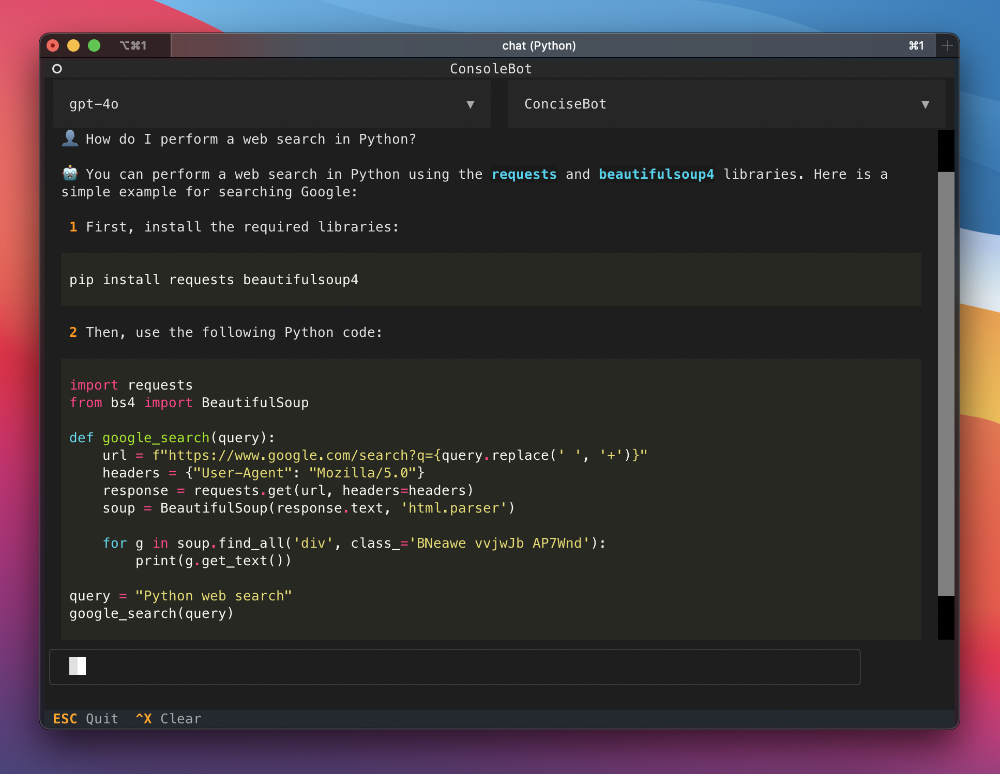

# About ConsoleBot
Chat with ChatGPT in your terminal!

This is a Command Line Interface (CLI) that allows you to chat with ChatGPT in your terminal. It is built using the [textual](https://textual.textualize.io/) library for Python and provides a simple and interactive way to access models like gpt-3.5-turbo, gpt-4-turbo and gpt-4o.

Author: Isak Barbopoulos (isak@xaros.org)

Just an example:


---

<details>
    <summary>Installation</summary><br>

#### 1. Make sure you have Python >=3.9 and an OpenAI API key.

#### 2. Open your terminal of choice and clone this repo:
```bash
git clone https://github.com/isak-b/console-bot.git
```

#### 3. Install the package and its dependencies:
```bash
cd console-bot
pip install .
```

#### 4. Create a file named '.env' in the console-bot folder and add the following line:
```bash
OPENAI_API_KEY=<your OpenAI API key here>
```
</details>

<details>
    <summary>Start a new chat</summary><br>

Open a terminal in the console-bot folder and write:

```bash
python chat
```

TIP: Bind the command to an alias (like 'chat') and store it in .bashrc or .zshrc for easy access. E.g.,:

```bash
alias chat='python ~/path/to/console-bot/chat'
```

</details>

<details>
    <summary>Create a new bot</summary><br>

Write your custom instructions in a .txt file and save it in `console-bot/bots/` and it will become automatically available in the app.

</details>

<details>
    <summary>Todo</summary><br>

- Make it so users can save and manage chat history (create, name and select history_ids at will)

- Add support for other LLMs

- Add image generation (not currently supported by textual)

</details>
