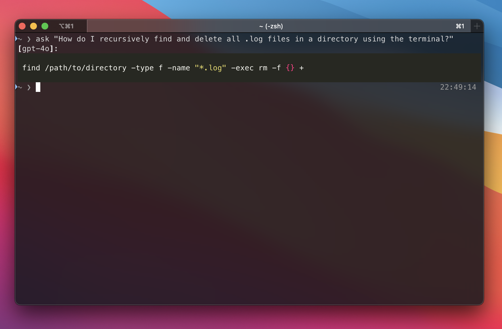

# About ConsoleBot
Chat with ChatGPT in your terminal!

This is a Command Line Interface (CLI) that allows you to chat with ChatGPT in your terminal.

**Author**: Isak Barbopoulos (isak@xaros.org)

### Usage

You can either open an interactive chat interface that runs in your terminal (built with the [textual](https://textual.textualize.io/) library for Python):


Or get an answer to a single question directly in the terminal:



See more details on how to install and use the bot below.

---

<details>
    <summary>Installation</summary><br>

#### 1. Make sure you have Python >=3.9 and an OpenAI API key.

#### 2. Open your terminal of choice and clone this repo:
```bash
git clone https://github.com/isak-b/console-bot.git
```

#### 3. Install the package and its dependencies:
```bash
cd console-bot
pip install .
```

#### 4. Create a file named '.env' in the console-bot folder and add the following line:
```bash
OPENAI_API_KEY=<your OpenAI API key here>
```

</details>

<details>
    <summary>Chat: Open an interactive chat interface</summary><br>

Open a terminal in the console-bot folder and write:

```bash
python chat
```

TIP: Bind the command to an alias (like 'chat') and store it in .bashrc or .zshrc for easy access. E.g.,:

```bash
alias chat='python ~/path/to/console-bot/chat'
```

</details>

<details>
    <summary>Ask: Get an answer directly in the terminal</summary><br>

Open a terminal in the console-bot folder and write:

```bash
python ask "What is the airspeed velocity of an unladen swallow?"
```

TIP: Bind the command to an alias (like 'ask') and store it in .bashrc or .zshrc for easy access. E.g.,:

```bash
alias ask='python ~/path/to/console-bot/ask'
```

</details>

<details>
    <summary>Create and load non-default config files</summary><br>

You can create your own config.yaml files and use them with either interface. Just point to the config file that you wish use:

Chat:
```bash
python chat "path/to/config.yaml"
```

Ask:
```bash
python ask "Some question" "path/to/config.yaml"
```

</details>

<details>
    <summary>Modify or create custom bot instructions</summary><br>

Write custom instructions in a .txt file and save it in `console-bot/chat/bots/`, and it will become automatically available as a bot in the app. You can set a default bot that will be pre-selected when the app starts by changing the "bot" value in `console-bot/chat/config.yaml` to e.g., "NewBot" if the .txt file is called `NewBot.txt`.

For the ask version of ConsoleBot, instead add your bots to `console-bot/ask/bots/`. Note that since the "ask" interface isn't interactive, you must set the bot you want to use in `console-bot/ask/config.yaml` or it will have no effect.

Note that the paths to the bots folder is relative to the config.yaml file. So you can also for example access the bots of the chat version by changing paths.bots to "../chat/bots/" (or any other folder where you might have bots).

</details>

<details>
    <summary>Todo</summary><br>

- Make it so users can save and manage chat history (create, name and select history_ids at will)

- Add support for other LLMs

- Add image generation (not currently supported by textual)

</details>
